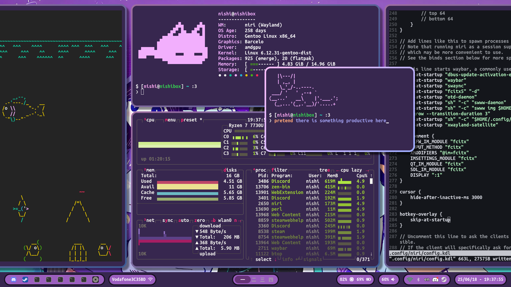

# niri dots
there is a good chance i probably missed something in my configs\
yell at me in issues if something no worky\
also my dots will probably not look exactly like the screenshots but it should probably be decently similar

## things you need (maybe):
niri (duh)\
swww\
swaybg (yea you need both cause i use swaybg for the overview wallpaper)\
swaync\
foot\
rofi\
hyprlock\
waybar\

